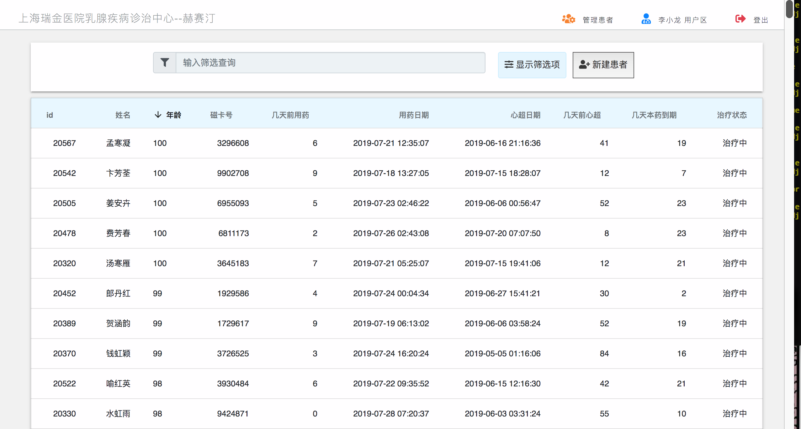
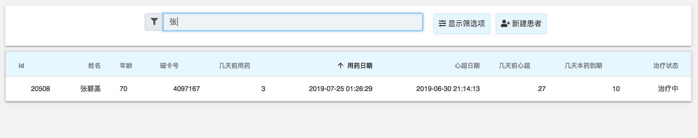
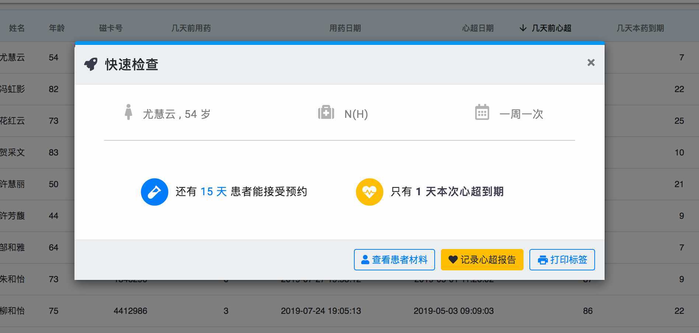
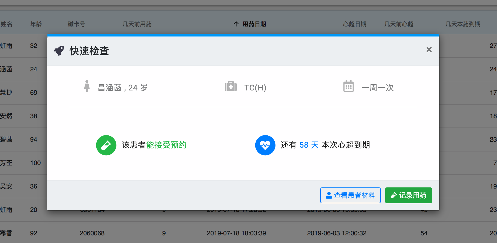
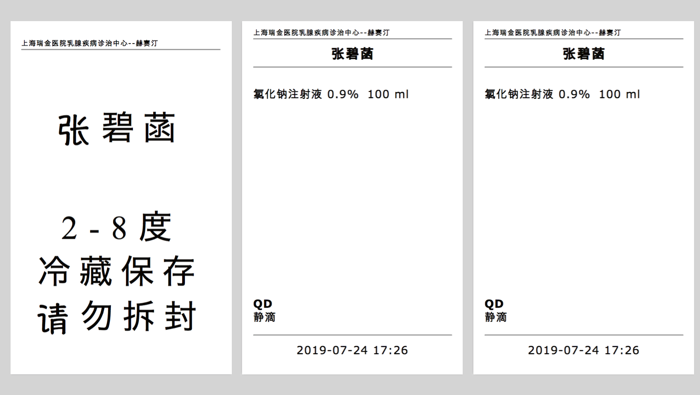
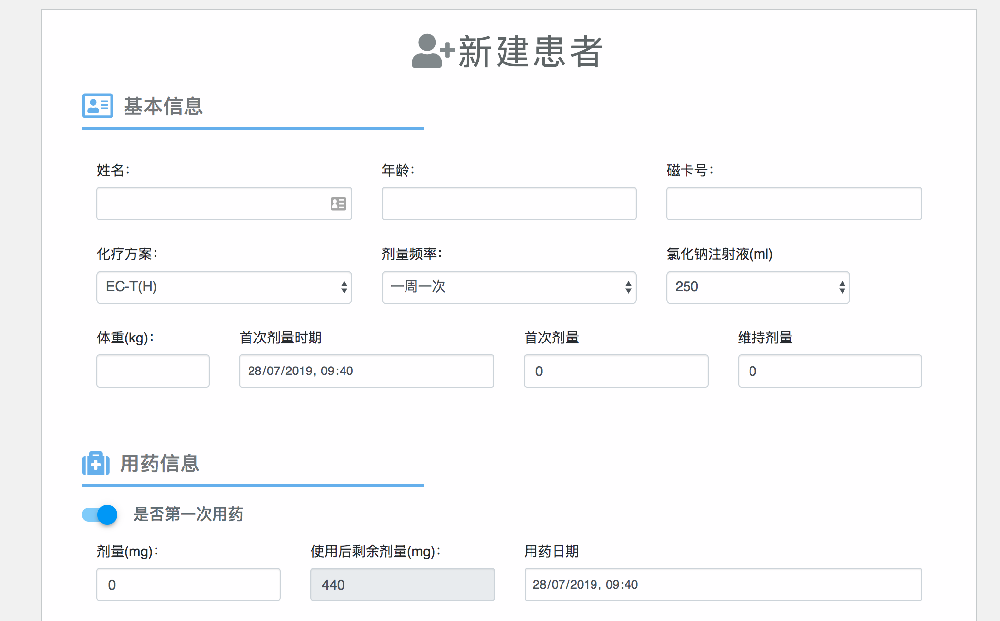

#About

This is a very fast SPA tool to help nurses manage chemotherapy doses. It is currently used in the Breast Cancer Ward at Shanghai Ruijin Hospital. 

#Some Features

- The main screen is a table which can be filtered and searched directly from the browser (no need to call the server multiple times). 

  

  

- The application has modals which let nurses know only the most important information about the patient (upcoming heart scans, when to set next appointment, etc.).

  

  

- Labels for the medicine vials are produced in pdf ready to print.

  

- Smart forms: the new patient form suggests dosages based on the procedure at the hospital and is designed to prevent typos and human error.

  

- The app keeps track of how much medicine is left in the last vial and calculates how many new vials need to be opened.

  

# Technical notes

As much medical software, the app is designed to reduce human error. For this reason, the frontend is written in Elm, which is a type-safe programming language that compiles to Javascript. The backend is just Django.

If you wish to use this at your hospital, it is likely that you will need to modify the app heavily; among other things the interface is in Chinese. Feel free to contact me and I will happily give some suggestions.

To demo it, you can run the install.sh script, which will generate a virtual environment, install all the dependencies and populate the app with demo data.

To run the app on an actual server you will need to modify the chemotherapy_history/static/elm_new/src/Request/Helpers.elm file to provide the address. You may also want to fiddle with nginx to allow some cross-domain hits to the django backend. For production you should also serve the backend using gunicorn or something like that.